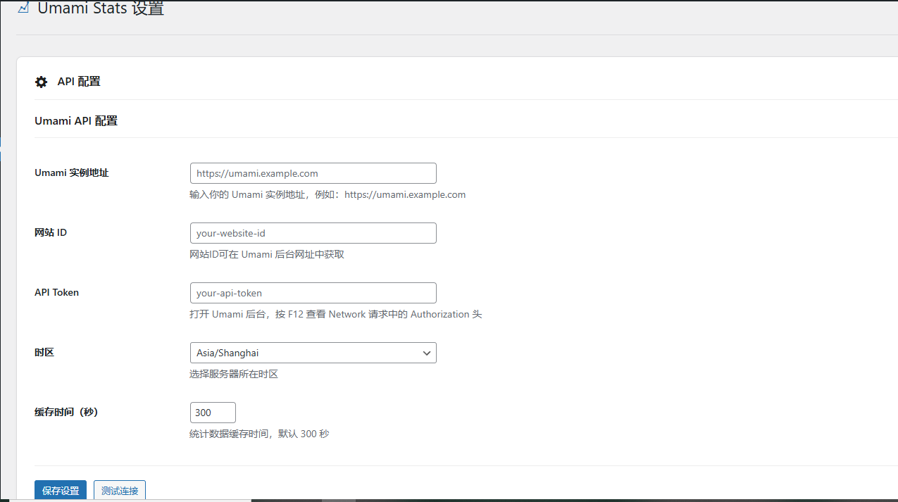
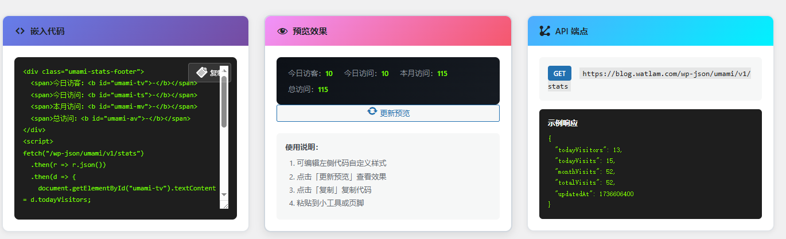

# Umami Stats WordPress Plugin

<p align="center">
  
  
  
</p>

<p align="center">
  <strong>在 WordPress 后台轻松管理和展示 Umami v3 统计数据</strong>
</p>

---

## 功能特点

- 🔧 **完善的设置页面** - 直观的后台界面配置 API 信息
- 📊 **实时数据仪表盘** - 查看今日访客、访问量、月度统计等
- 📋 **一键嵌入代码** - 生成可复制的嵌入代码，支持实时预览
- 🔌 **REST API 支持** - 通过 API 端点获取统计数据
- 🎨 **可自定义样式** - 编辑代码实时预览效果
- 🌐 **中文界面** - 完整的简体中文支持

## 截图

### 设置页面


### 仪表盘


## 安装

### 方式一：上传安装
1. 下载最新版本的插件压缩包
2. 进入 WordPress 后台 → 插件 → 安装插件 → 上传插件
3. 选择下载的压缩包并上传
4. 点击「启用插件」

### 方式二：手动安装
1. 下载并解压插件压缩包
2. 将 `umami-stats` 文件夹上传到 `wp-content/plugins/` 目录
3. 在 WordPress 后台 → 插件 中启用「Umami Stats」

## 配置

### 1. 获取 Umami API 信息

**Umami 实例地址**
- 你的 Umami 服务地址，例如：`https://umami.example.com`

**网站 ID**
- 在 Umami 后台网址中获取
- 例如 `https://yourdomain.com/websites/0ba3d4b8-95ec-4e33-a727-32b013d6cfa7`
- 粗体部分就是网站 ID

**API Token**
1. 打开 Umami 后台
2. 按 `F12` 打开开发者工具
3. 切换到 Network 标签
4. 刷新页面，找到 `websites/id` 请求
5. 查看请求头中的 `Authorization: Bearer xxx`
6. `Bearer` 后面的内容就是 Token

### 2. 配置插件
1. 进入 WordPress 后台 → Umami Stats → 设置
2. 填写 Umami 实例地址、网站 ID、API Token
3. 选择时区
4. 点击「保存设置」
5. 点击「测试连接」验证配置

## 使用

### 在小工具中显示统计
1. 进入 WordPress 后台 → 外观 → 小工具
2. 添加「自定义 HTML」小工具
3. 粘贴插件设置页面生成的嵌入代码
4. 保存即可

### 在页脚显示统计
编辑主题的 `footer.php` 文件，在合适位置添加嵌入代码。

### 通过 API 获取数据
```
GET /wp-json/umami/v1/stats
```

响应示例：
```json
{
  "todayVisitors": 13,
  "todayVisits": 15,
  "monthVisits": 52,
  "totalVisits": 52,
  "updatedAt": 1736606400
}
```

## 常见问题

### Q: 为什么显示连接失败？
A: 请检查：
- Umami 实例地址是否正确
- 网站 ID 是否正确
- API Token 是否有效
- 服务器是否能访问 Umami 实例

### Q: 统计数据多久更新一次？
A: 默认缓存 300 秒（5 分钟），可在设置中修改缓存时间。

### Q: 可以自定义显示样式吗？
A: 可以！在设置页面的「嵌入代码」区域直接编辑 CSS 样式，实时预览效果。

## 技术要求

- WordPress 5.0 或更高版本
- PHP 7.4 或更高版本
- Umami v3 实例

## 更新日志

查看 [CHANGELOG.md](CHANGELOG.md) 了解版本更新历史。

## 贡献

欢迎提交 Issue 和 Pull Request！

1. Fork 本仓库
2. 创建功能分支 (`git checkout -b feature/AmazingFeature`)
3. 提交更改 (`git commit -m 'Add some AmazingFeature'`)
4. 推送到分支 (`git push origin feature/AmazingFeature`)
5. 创建 Pull Request

## 开源协议

本插件采用 [GPL v2 或更高版本](LICENSE) 开源协议。

## 致谢

- [Umami](https://umami.is/) - 开源的网站分析工具
- [WordPress](https://wordpress.org/) - 开源内容管理系统

## 作者

- 博客：[Watlam's Blog](https://www.watlam.com)
- GitHub：[@watlam](https://github.com/watlam)

## 支持

如果你觉得这个插件有用，欢迎 ⭐ Star 支持一下！

如果遇到问题，请 [提交 Issue](https://github.com/watlam/umami-stats/issues)。
